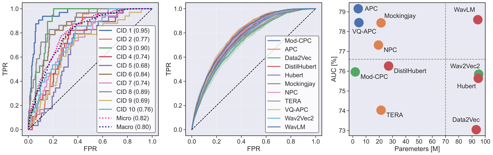

# Can Self-Supervised Neural Representations Pre-Trained on Human Speech distinguish Animal Callers? 

[[Paper]](https://www.isca-speech.org/archive/interspeech_2023/sarkar23_interspeech.html)
[[Video]](https://youtu.be/fU_Pt_OuW1U)
[[Slides]](https://eklavyafcb.github.io/docs/Sarkar_Interspeech_2023_Presentation.pdf)

<p align="center">
    <a href="https://github.com/idiap/ssl-caller-detection/blob/main/LICENSE">
        
    </a>
    <a href="https://github.com/idiap/ssl-caller-detection">
        
    </a>
    <a href="https://github.com/psf/black">
        
    </a>
</p>



## Cite

This repository contains the source code for the Interspeech accepted paper [Can Self-Supervised Neural Representations Pre-Trained on Human Speech distinguish Animal Callers?](https://www.isca-speech.org/archive/interspeech_2023/sarkar23_interspeech.html) by E. Sarkar and M. Magimai Doss (2023).

Please cite the original authors for their work in any publication(s) that uses this work:

```bib
@inproceedings{sarkar23_interspeech,
  author={Eklavya Sarkar and Mathew Magimai.-Doss},
  title={{Can Self-Supervised Neural Representations Pre-Trained on Human Speech distinguish Animal Callers?}},
  year=2023,
  booktitle={Proc. INTERSPEECH 2023},
  pages={1189--1193},
  doi={10.21437/Interspeech.2023-1968}
}
```

## Dataset

**COMING SOON**: The `InfantMarmosetsVox` dataset used for the experiments in this paper will be open-sourced along with a `torch` `Dataset` and `DataLoader`.

**At the moment, the paths referenced by this software are in the form ```/path/to/dataset/<something>```, thus the code is not fully runnable!**

## Installation

This package has very few requirements. 
To create a new conda/mamba environment, install [conda](https://conda.io), then [mamba](https://mamba.readthedocs.io/en/latest/installation.html#existing-conda-install), and simply follow the next steps:

```
mamba env create -f environment.yml           # Create env
mamba activate marmosets                      # Activate env
```

## Experiments
The following run compute the stated computations:

Preprocessing:
- `extract_features.py` extracts SSL embeddings.
- `extract_baselines.py` extracts handcrafted features.
- `embeddings2cid_pickles.py` converts the variable-length features to fixed-length functionals.

Study I - Caller Discrimination Analysis:
- `functionals2distributions.py` comptes the KL-divergence and Bhattacharya distance between extracted embeddings.

Study II - Caller Detection Study:
- `classifier_caller_groups.py` classifies the functionals using a ML classifier (SVM, RF, AB).
- `compile_results.py` compiles all the results computed from `classifier_caller_groups.py`.

Misc:
- `utils.py` contains utility functions such as loading the SSL embeddings or SSL functionals.

Note that the protocols of experiments above are defined in `marmoset_lists` which contains the sets splits and other mappings in `.pkl` files.

## Usage
The scripts above are independent, and need various parameters. To run any of the above experiments, see all the necessary requirements with:

```bash
python src/file.py -h
```

This will only run the permutation selected with the parameter variables.
To run all the experiments one would have to run a grid search across all possible values.
Note that the experiments in the paper were only run with the task `-t marmosetID` parameter.

## Directory Structure

The structure of this directory is organized as the following:

```
.
├── dataset                 # Dataset config files
├── environment.yml         # Environment file
├── img                     # Images
├── LICENSE                 # License
├── MANIFEST.in             # Setup
├── marmoset_lists          # Protocol lists and pickles
├── pkl                     # Pickles
├── pyproject.toml          # Setup
├── README.md               # This file
├── src                     # Python source code
└── version.txt             # Version
```

## Contact

For questions or reporting issues to this software package, kindly contact the first [author](mailto:eklavya.sarkar@idiap.ch).